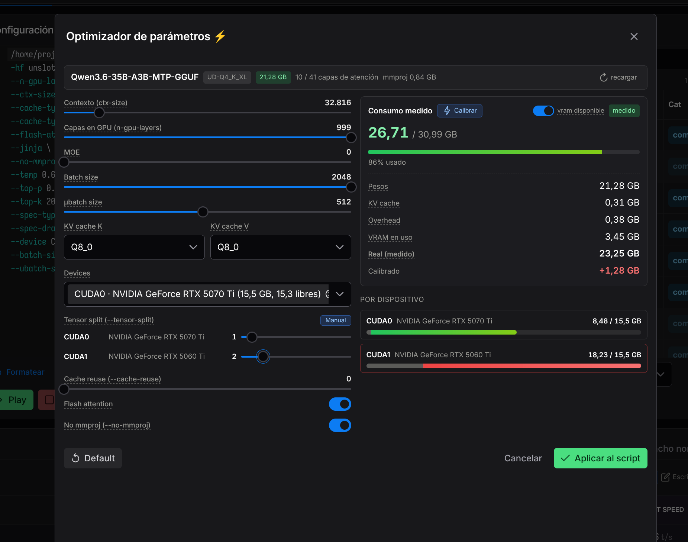
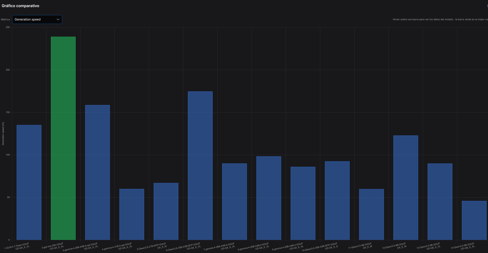
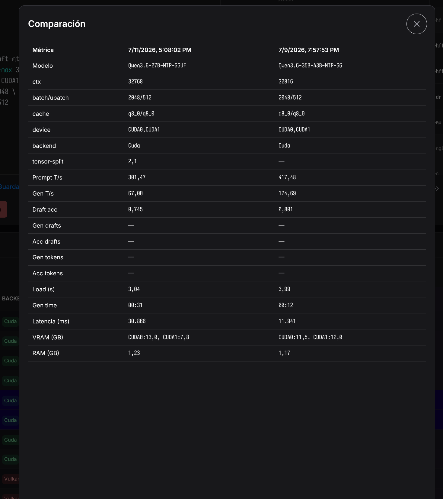
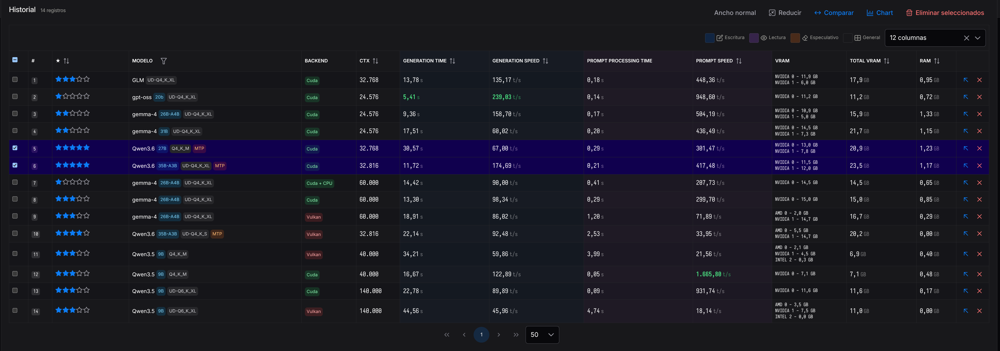

# plane-llama-bench

Utilidad web para hacer **benchmark de modelos locales con `llama.cpp`**,
controlando `llama-server` desde el navegador. Arranca el servidor, ejecuta un
prompt de inferencia, parsea los timings de los logs, captura métricas de
GPU/RAM y guarda los resultados para compararlos.







## Por qué no `llama-bench`

`llama-bench` no acepta muchos flags de `llama-server` (`--ctx-size`,
--cache-reuse`, `--spec-type`, `--temp`, `--jinja`, …), así que no refleja
correctamente MTP, speculative decoding, cache ni comportamiento multi-GPU.
Por eso esta herramienta hace el benchmark **real**: arranca `llama-server`,
espera `server is listening`(o muerte del proceso → error inmediato), lanza un`POST /v1/chat/completions`, parsea los timings de los logs y lee las métricas
de hardware.

## Funciones principales

- **Editor de script** con catálogo de ~270 flags de `llama-server` (búsqueda,
  filtros, descripciones, inserción directa).
- **Benchmark automático** de un click: parseo, arranque, health-check,
  inferencia, captura de métricas y guardado en historial.
- **Control manual** del servidor (play/stop) con status bar en vivo.
- **Métricas en tiempo real** de GPU (NVIDIA + AMD) y RAM, con polling.
- **Visor de logs** incremental con auto-scroll.
- **Historial** en tabla con selección múltiple, orden, filtros, columnas
  conmutables y highlights de los mejores valores.
- **Comparación** lado a lado y **gráfico** de barras de los resultados
  seleccionados.
- **Optimizador de parámetros**: heurística client-side de consumo de VRAM
  (pesos + KV cache + overhead) que lee la arquitectura real del header GGUF y
  recomienda `--ctx-size`, `--n-gpu-layers`, `--batch-size`, etc. sin arrancar
  el binario.

## Requisitos

- [Bun](https://bun.sh) ≥ 1.2 (gestionado con `mise`).
- `llama-server` compilado (backend Vulkan recomendado) en el `PATH` o en el
  directorio del repo. **No se incluye** ni se instala.
- Linux para las métricas de hardware (`nvidia-smi`, sysfs de AMD,
  `/proc/meminfo`).

## Desarrollo

Desde la raíz del repo. Primera vez: instalá Bun (vía `mise`) y las dependencias.

```bash
# desarrollo
mise install                # instala Bun via mise (si hace falta)
bun install                 # dependencias (incl. concurrently, electron)
bun run dev                 # web: backend (:3000) + frontend (:4242) → http://localhost:4242
```

Para probar el shell de **Electron** contra el backend de dev (arranca el
backend aparte con `bun run dev:back` y luego, en otra terminal):

```bash
bun run dev:electron        # compila el shell y lanza Electron → ventana de escritorio
```

> En modo Electron de dev, la app carga el backend que ya está corriendo en
> `:3000`. Ctrl+C detiene el backend; cerrar la ventana detiene Electron.

### Build y empaquetado

El backend se precompila a binario nativo standalone (`bun build --compile`),
el frontend se buildea y el shell de Electron se compila. Todo se empaqueta
como `.AppImage` de Linux en `release/`.

```bash
# build
bun run build:app           # frontend + backend compilado + shell de Electron
bun run dist                # build:app + electron-builder → release/*.AppImage
```

Variables de entorno:

| Variable            | Default          | Descripción                                          |
| ------------------- | ---------------- | ---------------------------------------------------- |
| `PORT`              | `3000`           | Puerto del backend (no 8080: es el de llama-server). |
| `LLAMA_SERVER_PATH` | `./llama-server` | Ruta al binario por defecto en la UI.                |
| `DATA_DIR`          | `./data`         | Carpeta donde se guarda `history.json` y defaults.   |

### Comandos útiles

```bash
# comandos útiles
bun run dev:back           # solo backend con --watch
bun run dev:front          # solo frontend (ng serve)
bun run start              # producción: solo backend (sin frontend)
bun run build:front        # build de producción del frontend → front/dist/
bun run build:back         # precompila el backend → electron/backend/ (binario nativo)
bun run build:electron     # compila el shell de Electron → dist-electron/
bun run typecheck          # tsc --noEmit del backend
bun run fix                # formatea todo con prettier
```

## Arquitectura

- **Backend** (`src/`): Bun + TypeScript, solo stdlib. API JSON pura en `:3000`
  (no sirve frontend). El router despacha a módulos por responsabilidad
  (benchmark, server-manager, gpu, devices, metrics, optimizer, history…).
- **Frontend** (`front/`): Angular 22 standalone (signals, zoneless) + PrimeNG
  21, app aparte servida en `:4242` que habla con el backend por HTTP (CORS `*`).
- **Persistencia**: `data/history.json` (máx 200 resultados, gitignored).
- **Empaquetado** (`electron/`): shell de Electron que lanza el backend
  precompilado como subproceso y carga el frontend en una ventana de escritorio.

```
src/       # Backend Bun: API JSON, gestión de llama-server, métricas, optimizador
front/     # Frontend Angular 22 + PrimeNG 21 (standalone, signals, zoneless)
electron/  # Shell de Electron (main.ts, preload.ts) → AppImage
data/      # Datos locales (gitignored): history.json + defaults
```

### Puertos

- **Backend**: `:3000` (deliberado — `llama-server` usa `:8080` por defecto y
  chocarían). Override con `PORT`.
- **Frontend (dev)**: `:4242` (ng serve).
- En el AppImage, Electron busca el primer puerto libre desde `:3000` y sirve
  frontend + backend en el mismo origen (same-origin, sin CORS).

### API del backend (`:3000`)

Todas las respuestas llevan `Access-Control-Allow-Origin: *`. Preflight
`OPTIONS` → 204.

| Método | Ruta              | Descripción                                                                  |
| ------ | ----------------- | ---------------------------------------------------------------------------- |
| GET    | `/status`         | Estado del proceso: `{ status, pid, startedAt, url, error }`.                |
| POST   | `/start`          | Inicia `llama-server` manual. Body `{ script }`. 409 si ya hay uno.          |
| POST   | `/stop`           | Detiene el servidor (SIGTERM → SIGKILL tras 8s).                             |
| GET    | `/logs?since=N`   | Logs incrementales desde el cursor `N`: `{ entries, cursor }`.               |
| POST   | `/logs/clear`     | Vacía el buffer de logs en memoria.                                          |
| GET    | `/gpu`            | Métricas en vivo: `{ gpus, ram }` (NVIDIA + AMD + RAM).                      |
| POST   | `/benchmark`      | Ejecuta el benchmark completo. 409 si ya hay benchmark o servidor activo.    |
| POST   | `/benchmark/stop` | Aborta el benchmark en curso. 404 si no hay.                                 |
| POST   | `/dryfit`         | Calibración real del optimizador (arranca, mide VRAM, detiene).              |
| POST   | `/estimate`       | Optimizador: devices + metadatos + heurística de VRAM. Sin arrancar binario. |
| GET    | `/history`        | `{ results: BenchmarkResult[] }` (máx 200).                                  |
| DELETE | `/history`        | Borra todo el historial.                                                     |
| DELETE | `/history/:id`    | Borra un resultado por id.                                                   |
| POST   | `/history/delete` | Borra varios: `{ ids: string[] }`.                                           |
| PATCH  | `/history/:id`    | Actualiza la calificación. Body `{ rating }`.                                |
| GET    | `/script-default` | Script por defecto guardado (texto plano). 404 si no existe.                 |
| POST   | `/script-default` | Guarda `{ script }`.                                                         |
| GET    | `/prompt-default` | Prompt por defecto (texto plano; default built-in si no existe).             |
| POST   | `/prompt-default` | Guarda `{ prompt }`.                                                         |

### Métricas capturadas

Cada benchmark produce un `BenchmarkResult`:

- **Rendimiento**: prompt tokens/s, prompt token count, prompt eval time,
  generation tokens/s, generation token count, generation time, load time,
  request latency.
- **Speculative decoding / draft-mtp**: draft acceptance (0–1), gen/acc drafts,
  gen/acc tokens.
- **Hardware**: VRAM usada por GPU (NVIDIA vía `nvidia-smi`, AMD vía sysfs),
  backend de cómputo deducido de `--list-devices` (`cuda`/`vulkan`/`sycl`/…),
  VRAM por **device del backend** (CUDA0, Vulkan0… — cubre Intel vía Vulkan),
  RAM usada (delta `/proc/meminfo`).

> Hay dos sistemas paralelos de VRAM: `deviceVram` (delta de VRAM libre del
> propio binario vía `--list-devices`) es el preferido; si está vacío, el
> render cae a `gpus` (nvidia-smi/sysfs).

## Empaquetado AppImage (Electron)

La app se empaqueta como `.AppImage` de Linux. El backend (Bun) y el frontend
(Angular) **no se reescriben**: el backend se precompila a binario nativo
standalone (`bun build --compile`) y Electron lo lanza como subproceso.

- **`DATA_DIR` escribible**: el AppImage es read-only; los datos
  (`history.json`, defaults) viven en `~/.config/plane-llama-bench`
  (`app.getPath('userData')`), persistente entre actualizaciones.
- **`llama-server` externo**: no se embebe. Se detecta del `PATH` (vía
  `Bun.which`); si no está, la UI muestra un error claro. Se puede indicar la
  ruta absoluta en el script.
- **Same-origin**: en el AppImage, el backend sirve los estáticos del frontend
  en el mismo puerto (`env.FRONT_DIST`), así no hay CORS ni mixed-content.

```bash
bun run dist    # → release/plane-llama-bench-<ver>-x86_64.AppImage
```

## Optimizador de parámetros

Diálogo que precalcula parámetros de `llama-server` según la VRAM disponible,
**sin arrancar el binario**. Estimación puramente heurística (client-side):

```
VRAM = pesos + KV cache + overhead
```

- **Pesos**: tamaño real del `.gguf` en disco (resuelto desde `-hf` → HF cache o
  `--model` → ruta), ajustado por el offload fraction de `--n-gpu-layers`.
- **KV cache**: `2 × capas × kv_heads × head_dim × ctx × bytes_kv`. Las capas,
  KV heads y head_dim se leen del **header GGUF** del archivo (parser binario),
  no se adivinan por familia.
- **Overhead**: `128 + ubatch × 0.5` MiB (buffers del backend).

La heurística se calcula como `computed` (instantánea, sin HTTP por cada slider).
La única llamada HTTP al abrir es `POST /estimate` (ejecuta `--list-devices` y
resuelve el archivo).

## Notas

- **Linux-only** para métricas de hardware (`nvidia-smi`, sysfs de AMD,
  `/proc/meminfo`). El resto funciona en cualquier plataforma con Bun.
- **Log parsing frágil**: las regex matchean formatos específicos de
  `llama-server`; si el binario cambia, las métricas quedan `null` silenciosamente.
- **UI en español**; los comentarios del código también.
- **Tipos espejo**: `src/types.ts` (backend) y `front/.../core/models/types.ts`
  son espejos manuales (proyectos separados). Si una interfaz cambia, actualizar
  ambos.
