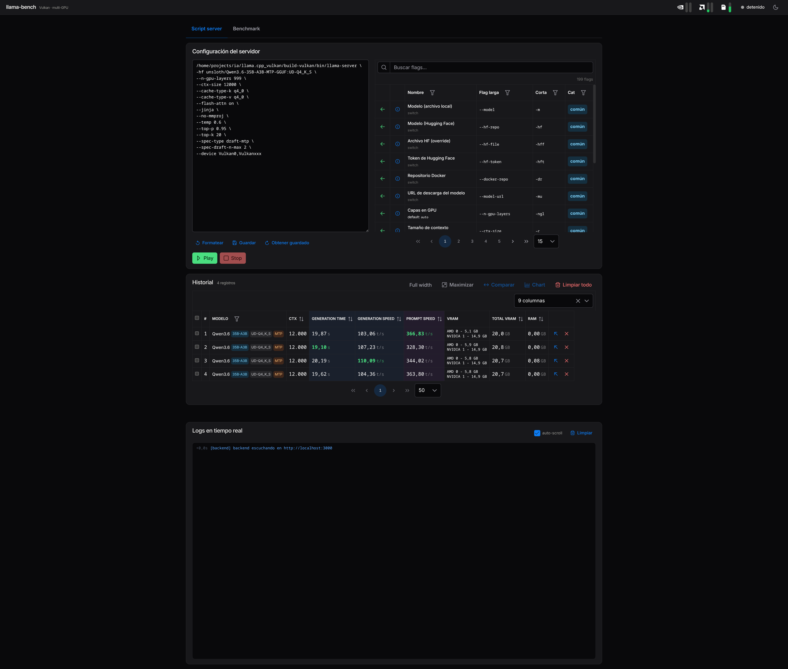
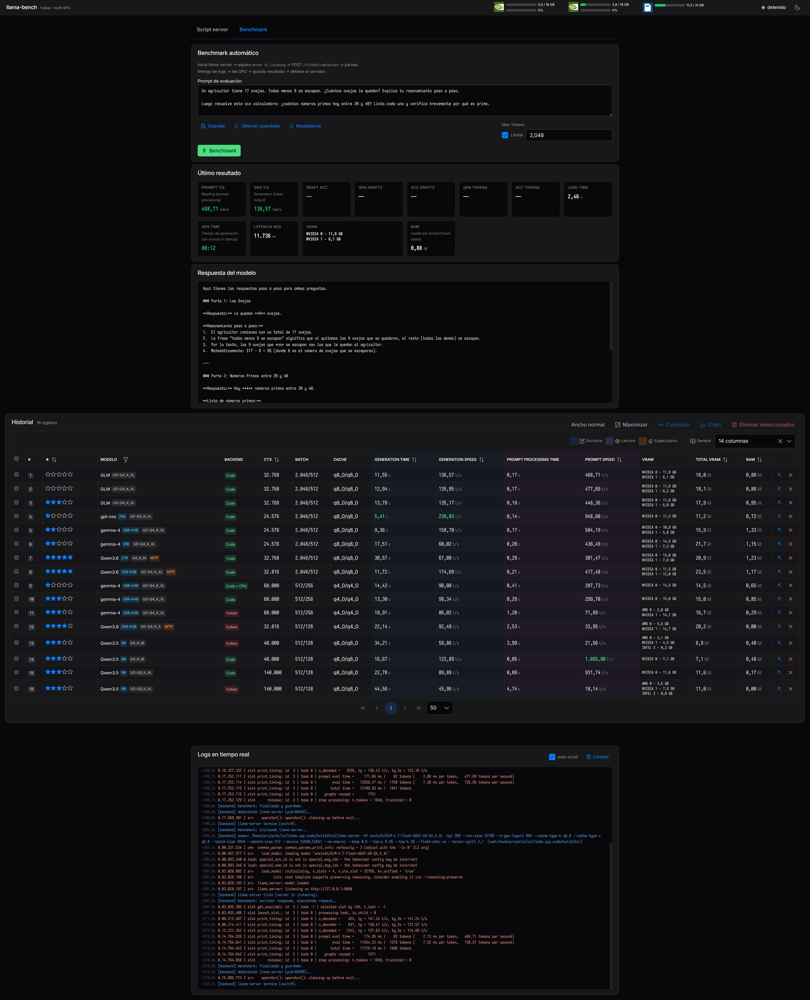

# llama-bench-web

Utilidad web para hacer benchmark de modelos locales con **llama.cpp**,
controlando `llama-server` desde el navegador.

<details>
<summary>Click to toggle screenshots</summary>




</details>

---

- **Backend:** Bun + TypeScript (solo stdlib, sin frameworks). Expone la **API
  JSON** en `:3000` (no sirve frontend).
- **Frontend:** Angular 22 + PrimeNG 21, app aparte en `front/` servida en
  `:4242` (dev). Habla con el backend por HTTP (CORS `*`).
- **Benchmark real** contra `llama-server` (no `llama-bench`), porque refleja
  correctamente MTP, speculative decoding, cache y comportamiento multi-GPU Vulkan.

> El frontend anterior (vanilla TS servido por `Bun.build()` + `public/`) fue
> migrado a Angular. El backend quedó como API pura.

---

## Tabla de contenidos

- [Por qué no `llama-bench`](#por-qué-no-llama-bench)
- [Requisitos](#requisitos)
- [Uso](#uso)
- [Endpoints (backend `:3000`)](#endpoints-backend-3000)
- [Métricas capturadas](#métricas-capturadas)
- [Funciones de la UI](#funciones-de-la-ui)
  - [Editor de script + catálogo de flags](#editor-de-script--catálogo-de-flags)
  - [Control manual del servidor](#control-manual-del-servidor)
  - [Benchmark automático](#benchmark-automático)
  - [Métricas en vivo (GPU + RAM)](#métricas-en-vivo-gpu--ram)
  - [Visor de logs](#visor-de-logs)
  - [Resultado y respuesta](#resultado-y-respuesta)
  - [Historial](#historial)
  - [Comparación](#comparación)
  - [Gráfico](#gráfico)
- [Arquitectura](#arquitectura)
- [Hardware objetivo](#hardware-objetivo)
- [Auto-tuning (futuro)](#auto-tuning-futuro)
- [Estructura](#estructura)

---

## Por qué no `llama-bench`

`llama-bench` **no acepta** muchos flags de `llama-server`:

`--ctx-size`, `--cache-reuse`, `--jinja`, `--temp`, `--top-p`, `--top-k`,
`--metrics`, `--log-prefix`, `--spec-type`, `--spec-draft-n-max`.

Por eso esta herramienta hace el benchmark real:

1. Inicia `llama-server`.
2. Espera `server is listening` (o muerte del proceso → error inmediato).
3. Ejecuta un prompt vía `POST /v1/chat/completions`.
4. Parsea timings de los logs (`prompt eval time`, `eval time`,
   `draft acceptance`, `model loaded`, estadísticas draft-mtp).
5. Lee métricas de GPU (NVIDIA + AMD), devices del backend (`--list-devices`)
   y RAM del sistema.
6. Guarda el resultado.
7. Detiene el servidor automáticamente.

---

## Requisitos

- [Bun](https://bun.sh) ≥ 1.2 (gestionado con `mise` via `mise.toml`).
- `llama-server` compilado (con backend Vulkan recomendado) en el `PATH` o en
  el directorio del repo.
- `nvidia-smi` (para VRAM/util de NVIDIA) — opcional.
- Para AMD, se usa sysfs (`/sys/class/drm/card*/device/mem_info_*`), sin
  depender de `radeontop`.
- Linux para las métricas de hardware (GPU + RAM vía `/proc/meminfo`).

---

## Uso

Desde la raíz del repo (orquesta backend + frontend juntos):

```bash
mise install        # instala Bun via mise (si hace falta)
bun install         # deps de la raíz (incl. concurrently)
bun run dev         # dev conjunto: backend (:3000) + frontend (:4242)
```

Abrí **http://localhost:4242**. Ctrl+C detiene ambos procesos a la vez
(`concurrently -k` mata al otro si uno muere).

Otros scripts:

```bash
bun run dev:back       # solo backend con --watch
bun run dev:front      # solo frontend Angular (ng serve)
bun run start          # producción: solo backend
bun run build:front    # build de producción del frontend → front/dist/
bun run typecheck      # tsc --noEmit del backend
bun run fix            # formatea con prettier
```

Variables de entorno:

| Variable            | Default          | Descripción                                          |
| ------------------- | ---------------- | ---------------------------------------------------- |
| `PORT`              | `3000`           | Puerto del backend (no 8080: es el de llama-server). |
| `LLAMA_SERVER_PATH` | `./llama-server` | Ruta al binario por defecto en la UI.                |
| `DATA_DIR`          | `./data`         | Carpeta donde se guarda `history.json` y defaults.   |

---

## Endpoints (backend `:3000`)

Todas las respuestas llevan CORS `Access-Control-Allow-Origin: *` (no usar
`withCredentials` desde el frontend). Preflight `OPTIONS` → 204.

| Método | Ruta              | Descripción                                                                       |
| ------ | ----------------- | --------------------------------------------------------------------------------- |
| GET    | `/status`         | Estado del proceso: `{ status, pid, startedAt, url, error }`.                     |
| POST   | `/start`          | Inicia `llama-server` manual. Body `{ script }`. 409 si ya hay uno corriendo.     |
| POST   | `/stop`           | Detiene el servidor: SIGTERM (SIGKILL tras 8s si no muere).                       |
| GET    | `/logs?since=N`   | Logs incrementales desde el cursor `N`: `{ entries, cursor }`.                    |
| POST   | `/logs/clear`     | Vacía el buffer de logs en memoria.                                               |
| GET    | `/gpu`            | Métricas en vivo: `{ gpus: GpuInfo[], ram: RamInfo }` (NVIDIA + AMD + RAM).       |
| POST   | `/benchmark`      | Ejecuta el benchmark completo. 409 si ya hay benchmark o servidor manual activo.  |
| POST   | `/benchmark/stop` | Aborta el benchmark en curso vía `AbortController`. 404 si no hay.                |
| GET    | `/script-default` | Script por defecto guardado (texto plano). 404 si no existe.                      |
| POST   | `/script-default` | Guarda `{ script }`.                                                              |
| GET    | `/prompt-default` | Prompt por defecto (texto plano); si no existe, devuelve el built-in (nunca 404). |
| POST   | `/prompt-default` | Guarda `{ prompt }`.                                                              |
| GET    | `/history`        | `{ results: BenchmarkResult[] }` (máx 200, drop oldest).                          |
| DELETE | `/history`        | Borra todo el historial.                                                          |
| DELETE | `/history/:id`    | Borra un resultado por id (URL-encoded).                                          |

**Body de `POST /benchmark`:**

```jsonc
{
  "script": "./llama-server -m modelo.gguf --ctx-size 8192 ...",
  "prompt": "Texto del prompt", // opcional, default built-in
  "max_tokens": 2048, // number > 0, o null = sin límite (hasta EOS)
}
```

---

## Métricas capturadas

Cada benchmark produce un `BenchmarkResult` con:

**Rendimiento del modelo**

| Campo                       | Descripción                                       |
| --------------------------- | ------------------------------------------------- |
| `promptTokensPerSecond`     | Tokens/s en prompt eval (TTFT inverso).           |
| `promptTokenCount`          | Cantidad de tokens del prompt.                    |
| `promptEvalTimeMs`          | Tiempo de procesado del prompt (ms).              |
| `generationTokensPerSecond` | Tokens/s en generación.                           |
| `generationTokenCount`      | Tokens generados.                                 |
| `generationTimeMs`          | Tiempo de generación (ms), sin prompt ni startup. |
| `loadTimeSeconds`           | Tiempo de carga del modelo (s).                   |
| `requestLatencyMs`          | Latencia total del request HTTP al servidor.      |

**Speculative decoding / draft-mtp**

| Campo             | Descripción                                 |
| ----------------- | ------------------------------------------- |
| `draftAcceptance` | Aceptación del draft (fracción 0–1).        |
| `genDrafts`       | drafts generados (`#gen drafts`).           |
| `accDrafts`       | drafts aceptados (`#acc drafts`).           |
| `genTokens`       | tokens generados vía draft (`#gen tokens`). |
| `accTokens`       | tokens aceptados vía draft (`#acc tokens`). |

**Hardware**

| Campo        | Descripción                                                                                                        |
| ------------ | ------------------------------------------------------------------------------------------------------------------ |
| `gpus`       | Delta de VRAM usada + % util por GPU (NVIDIA vía `nvidia-smi`, AMD vía sysfs).                                     |
| `backend`    | Backend de cómputo deducido de `--list-devices`: `cuda`/`vulkan`/`sycl`/…                                          |
| `deviceVram` | Delta de VRAM libre por **device del backend** (CUDA0, Vulkan0…), filtrado por `--device`. Cubre Intel vía Vulkan. |
| `ramUsedMiB` | Delta de RAM del sistema usada durante el run (Linux `/proc/meminfo`).                                             |

> Hay dos sistemas paralelos de VRAM: `deviceVram` (delta de VRAM libre
> reportado por el propio binario vía `--list-devices`) es el preferido; si está
> vacío, el render cae a `gpus` (nvidia-smi/sysfs).

Ejemplo:

```json
{
  "promptTokensPerSecond": 31.14,
  "generationTokensPerSecond": 50.22,
  "draftAcceptance": 0.867,
  "genDrafts": 418,
  "accDrafts": 403,
  "genTokens": 836,
  "accTokens": 783,
  "loadTimeSeconds": 5.44,
  "requestLatencyMs": 4520.0,
  "backend": "vulkan",
  "deviceVram": [
    { "device": { "id": "Vulkan0", "name": "NVIDIA GeForce RTX 5070 Ti", "vendor": "nvidia" }, "usedMiB": 7200 },
    { "device": { "id": "Vulkan1", "name": "AMD RADV NAVI23", "vendor": "amd" }, "usedMiB": 6100 }
  ],
  "ramUsedMiB": 1840,
  "errors": []
}
```

---

## Funciones de la UI

La app (Angular 22, standalone + signals + zoneless, PrimeNG 21 preset Noir,
modo oscuro) se organiza en dos pestañas — **Script server** y **Benchmark** —
con el historial, los modales y el visor de logs siempre visibles.

### Editor de script + catálogo de flags

- Textarea con el script crudo de `llama-server` (continuaciones `\`, comillas,
  comentarios `#`). Al **pegar** se formatea automáticamente.
- **Formatear** — normaliza espacios/continuaciones del script.
- **Guardar / Obtener** default del script (con confirmación).
- **Catálogo de flags** (`p-table`): búsqueda global, filtros por nombre / flag
  larga / flag corta / categoría (multiselect), paginación. Cada flag ofrece:
  - **Agregar al script** — inserta el flag sin pisar valor existente.
  - **Info** — diálogo con descripción, códigos, alias y default.
- Los flags ya presentes en el script se **resaltan** en el catálogo.
- Categorías con color: común (info), muestreo (success), especulativo (warn).

### Control manual del servidor

- **Play** — formatea el script silenciosamente y hace `POST /start`.
- **Stop** — `POST /stop` (SIGTERM → SIGKILL tras 8s).
- **Status bar**: punto de color (detenido/iniciando/corriendo/error) + label
  en español + meta (`pid X · url · error`).
- Ambos botones se deshabilitan según el estado (y durante un benchmark).

### Benchmark automático

- Textarea del prompt + **Max Tokens** (checkbox "Limitar" + inputNumber).
  Con el checkbox desactivado se envía `max_tokens: null` → el modelo genera
  hasta EOS (no se aplica el default interno de llama-server).
- **Guardar / Obtener / Restablecer** el prompt default.
- **Benchmark** (⚡) — formatea el script, `POST /benchmark` (bloqueante). Al
  terminar: pinta resultado, refresca historial y muestra toast (success si ok,
  warn si hubo errores parciales, **error** si el servidor no arrancó).
- **Detener** — `POST /benchmark/stop` (visible solo durante el run).
- **Timer** transcurrido `M:SS` (actualizado cada 200ms) + texto de estado.

> Si `llama-server` muere durante el arranque (`exit=1`: modelo inválido, OOM,
> crash…), el benchmark falla **de inmediato** con un toast de error en vez de
> esperar el timeout del health-check.

### Métricas en vivo (GPU + RAM)

- Una **card por GPU** (chip de marca con SVG + dos barras verticales: VRAM y
  % utilización, con color verde/amarillo/rojo) en el header.
- Una **card de RAM** del sistema (total + % usado).
- Refresco por polling cada 4s. Soporta NVIDIA + AMD.

### Visor de logs

- Salida en tiempo real (polling cada 1s, incremental por cursor) de stdout,
  stderr y mensajes del propio backend.
- Timestamp relativo (`+X.Xs`), color por stream.
- Checkbox **auto-scroll** + botón **Limpiar** (`POST /logs/clear`).
- Cap de 4000 líneas en memoria (drop oldest).

### Resultado y respuesta

- **Último resultado**: tarjeta con todas las métricas del último run —
  Prompt T/s, Gen T/s, Draft acc, **draft-mtp** (gen/acc drafts, gen/acc
  tokens), load time, gen time, latencia, VRAM por device, RAM usada y errores.
- **Respuesta**: texto generado por el modelo (`content` o `reasoning_content`)
  en un panel mono-espaciado con scroll.

### Historial

Tabla (`p-table`) con todos los resultados. Es el componente más rico:

- **Selección múltiple**: checkbox por fila + "seleccionar todo" (con estado
  indeterminate) que respeta filtro/paginación.
- **Columnas conmutables** (multiselect con chips, persiste en localStorage):
  Fecha, Modelo (con tags de size/quant/**MTP**), ctx, batch/ubatch,
  cache K/V, device (tag del backend CUDA/Vulkan + valor), tensor-split,
  tokens generados, tiempos, velocidades, **draft-mtp** (acc, gen/acc drafts,
  gen/acc tokens), load, VRAM (por device o legacy), Total VRAM, RAM.
- **Orden** por columna (persistido), **filtro por modelo** (multiselect).
- **Highlights**: se resaltan las celdas con el mejor valor de toda la history
  (prompt/gen T/s, draft acc, load/gen time).
- **Acciones por fila**: ↗ aplicar la config al editor, ✕ eliminar (con
  confirmación).
- Toolbar: toggle **ancho completo** / **maximizar** (overlay full-screen),
  botones **Comparar** y **Chart**, **Limpiar todo** (zona de peligro).

### Comparación

Modal (`p-dialog`, resizable, 92vw) que muestra los resultados seleccionados
**lado a lado** en una tabla transpuesta: métricas como filas, resultados como
columnas (con fecha de cabecera). Incluye todas las métricas, config y
draft-mtp. Requiere ≥2 seleccionados.

### Gráfico

Modal full-screen (`p-chart` / Chart.js) con gráfico de barras de los
resultados seleccionados (≥1). Selector de métrica entre 11 opciones
(velocidades, tiempos, latencia, load, **draft acceptance**, VRAM total, RAM,
ctx, tokens generados). La barra del **mejor valor** se pinta de verde
(según `lowerIsBetter`); tooltip multi-línea en hover con todos los datos del
modelo. Colores adaptados al tema (lee variables CSS en runtime).

---

## Arquitectura

### Backend (`src/`)

Servidor HTTP modular sin frameworks. `server.ts` es el entry point; el router
despacha la API JSON a los módulos. **No sirve archivos estáticos**.

| Módulo              | Responsabilidad                                                                   |
| ------------------- | --------------------------------------------------------------------------------- |
| `server.ts`         | Entry point: bootstrap, `Bun.serve`, shutdown handlers.                           |
| `config.ts`         | Constantes de entorno y paths (`PORT`, `DATA_DIR`, `HISTORY_FILE`, caps).         |
| `state.ts`          | Estado global mutable (`managed`, `status`, `logBuffer`, …) + setters.            |
| `types.ts`          | Interfaces del dominio (`BenchmarkResult`, `GpuInfo`, `ParsedScript`, …).         |
| `logs.ts`           | Buffer circular de logs (`pushLog`, `systemLog`).                                 |
| `script-parser.ts`  | Tokenizado/parseo del script (`tokenizeScript`, `parseScript`, `flagValue`).      |
| `server-manager.ts` | Gestión del proceso (`startServer`, `stopServer`, `urlFor`, ready/exit).          |
| `gpu.ts`            | Métricas GPU NVIDIA (`nvidia-smi`) + AMD (sysfs) + `subtractGpuBaseline`.         |
| `mem.ts`            | Métricas RAM (`/proc/meminfo`) + `subtractRamBaseline`.                           |
| `devices.ts`        | Enumeración de devices del backend (`--list-devices`), detección de backend/VRAM. |
| `metrics.ts`        | Parsing de métricas desde logs + health-check (`waitForServer`).                  |
| `benchmark.ts`      | Orquestador del ciclo completo (`runBenchmark`, `finalize`).                      |
| `history.ts`        | Persistencia JSON (`loadHistory`, `saveResult`, `deleteResult`, cap 200).         |
| `router.ts`         | HTTP handler: path matching manual + CORS (solo API).                             |
| `shutdown.ts`       | Cierre ordenado ante signals (SIGINT/SIGTERM/SIGHUP) → mata el hijo.              |

### Frontend (`front/`)

Angular 22 standalone (signals, zoneless, `OnPush`) + PrimeNG 21 (preset
Noir). Mandates: `inject()`, `input()/output()/computed()`, control flow
nativo (`@if/@for`), lazy loading de rutas.

| Ruta / componente           | Responsabilidad                                                   |
| --------------------------- | ----------------------------------------------------------------- |
| `core/services/api`         | Wrapper `HttpClient` + manejo de errores unificado (lanza Error). |
| `core/services/llama-bench` | Un Observable por endpoint del backend.                           |
| `core/services/storage`     | 4 claves de `localStorage` (script, prompt, sort, modelFilter).   |
| `core/state/bench.store`    | Estado central con signals + actions + effects de persistencia.   |
| `features/home`             | Orquestador: polling (status 1.5s, logs 1s, gpu 4s) + carga.      |
| `features/script-editor`    | Editor de script + catálogo de flags.                             |
| `features/benchmark-panel`  | Ejecución del benchmark + prompt + max tokens.                    |
| `features/status-bar`       | Indicador visual del estado del servidor.                         |
| `features/gpu-grid`         | Métricas GPU + RAM en vivo (cards con barras).                    |
| `features/logs-viewer`      | Salida de logs en tiempo real.                                    |
| `features/response-card`    | Respuesta generada por el modelo.                                 |
| `features/last-result`      | Tarjeta de métricas del último benchmark.                         |
| `features/history-table`    | Tabla de historial (selección, orden, filtros, columnas).         |
| `features/compare-modal`    | Comparación lado a lado.                                          |
| `features/chart-modal`      | Gráfico de barras comparativo.                                    |

### Data flow

1. El usuario configura el script (editor) y el prompt (panel de benchmark);
   ambos persisten en `localStorage`.
2. **Modo manual**: Play → poll `/status` + `/logs` → ver salida → Stop.
3. **Modo benchmark**: `POST /benchmark` → el backend spawnea `llama-server`
   → espera ready (o muerte del proceso) → health-check HTTP → request de
   inferencia → parsea métricas → lee GPU/devices/RAM → guarda resultado →
   detiene servidor → devuelve resultado.
4. Resultados persistidos en `data/history.json` (array JSON, máx 200).
5. El frontend hace polling de `/status` (1.5s), `/logs` (1s), `/gpu` (4s).

### Lifecycle del benchmark

`runBenchmark()` orquesta el ciclo completo, con `checkAbort()` en cada
checkpoint (cancelable desde la UI):

1. Parsear el script (error → resultado fallido temprano).
2. Capturar **baseline** de GPU + RAM + devices del backend (en paralelo).
3. Crear `AbortController` (para cancelar desde la UI).
4. Arrancar `llama-server` y **esperar `ready`** (rechaza al instante si el
   proceso muere durante el arranque).
5. Health-check HTTP (`waitForServer`, polling 500ms, timeout 120s).
6. `POST /v1/chat/completions` (stream=false) con sampling del script.
7. Medir latencia del request.
8. Parsear métricas de los logs.
9. Capturar GPU/devices/RAM finales y restar baseline.
10. Detener servidor (**siempre**, en `finally`).
11. Persistir resultado y devolverlo.

El endpoint `POST /benchmark` guarda contra concurrencia con un flag
(`benchmarkRunning`) → 409 si ya hay uno corriendo o si hay servidor manual activo.

### Gestión del proceso

`llama-server` es un proceso hijo vía `Bun.spawn()`:

- **Grupo propio** (`detached: true`): `kill(-pid)` mata todo el árbol, sin
  huérfanos.
- **Shutdown graceful**: `stopServer()` envía SIGTERM al grupo, espera 8s,
  luego SIGKILL. En el cierre del backend (signals) usa un timeout más corto (3s).
- **Detección de ready**: poll de stdout por `server is listening` /
  `llama server listening` / `HTTP server listening` / `all slots are ready`.
- **CWD y `LD_LIBRARY_PATH`** apuntan al directorio del binario para resolver
  `.so` relativas (`libllama-server-impl.so`, etc.).

### Métricas de GPU / devices

Dos caminos (ambos Linux-only):

1. **`gpu.ts`** — `nvidia-smi` CSV (vendor `nvidia`) + sysfs AMD (`mem_info_*`,
   `gpu_busy_percent`, vendor `amd`). Mide VRAM usada y % util del SO.
2. **`devices.ts`** — `llama-server --list-devices`. Los ids son del BACKEND
   (CUDA0, Vulkan0, …), no del SO. Cubre vendors que sysfs/nvidia-smi no miden
   (p.ej. **Intel** vía Vulkan). El VRAM usado por el modelo se deriva del
   delta de VRAM libre reportada por el binario, filtrado por `--device`.

La detección del **backend** (`cuda`/`vulkan`/`sycl`/`metal`/`opencl`/`cann`/`cpu`)
se infiere del prefijo del primer device retornado por `--list-devices`.

### Gotchas

1. **Puerto 3000, no 8080**: el backend evita deliberadamente el puerto default
   de `llama-server`. No "arreglarlo" a 8080.
2. **`llama-server` requerido**: no viene en el repo ni lo instala ningún script.
3. **Métricas Linux-only**: ni `nvidia-smi`/sysfs ni `/proc/meminfo` funcionan
   en macOS/Windows.
4. **Log parsing frágil**: las regex matchean formatos específicos de
   `llama-server`; si el binario cambia, las métricas quedan `null` silenciosamente.
5. **`kill(-pid)`**: usa PID negativo para matar el grupo. No funciona en Windows
   (el proyecto es Linux-targeted).
6. **Cap del historial**: 200 entradas, drop oldest, sin paginación.
7. **`data/` gitignored**: `history.json` no se trackea; cada dev tiene su historial local.
8. **CORS `*`**: el backend no usa `withCredentials` (incompatible con `*`); el
   frontend Angular en `:4242` llama directo al backend en `:3000` sin proxy.
9. **UI en español**: todo el texto orientado al usuario está en español; los
   comentarios del código también.
10. **Tipos espejo**: `src/types.ts` (backend) y `front/.../core/models/types.ts`
    son espejos manuales (proyectos separados). Si una interfaz cambia, actualizar
    ambos lados.

---

## Hardware objetivo

- Intel i5-12600K
- RTX 5070 Ti 16 GB (Vulkan0)
- RX 6600 8 GB (Vulkan1)
- CachyOS Linux, backend Vulkan
- Configuración típica multi-GPU: `--device Vulkan0,Vulkan1`

---

## Auto-tuning (futuro)

El diseño está pensado para iterar sobre combinaciones de:
`tensorSplit`, `ctx`, `cache-type`, `batch` y encontrar automáticamente la
configuración óptima para RTX 5070 Ti + RX 6600.

---

## Estructura

```
.
├── src/               # Backend (Bun, API pura)
│   ├── server.ts      # Entry point: Bun.serve + bootstrap
│   ├── router.ts      # Handler HTTP (solo API JSON + CORS)
│   ├── benchmark.ts   # Orquestador del benchmark completo
│   ├── server-manager.ts # Gestión del proceso llama-server
│   ├── devices.ts     # Enumeración de devices del backend (--list-devices)
│   ├── gpu.ts         # Métricas GPU NVIDIA + AMD
│   ├── mem.ts         # Métricas RAM (/proc/meminfo)
│   ├── metrics.ts     # Parsing de métricas + health-check
│   ├── history.ts     # Persistencia del historial (history.json)
│   ├── script-parser.ts # Tokenizado/parseo del script de shell
│   ├── shutdown.ts    # Cierre ordenado ante signals
│   ├── config.ts      # Constantes de entorno y paths
│   ├── state.ts       # Estado global mutable + setters
│   ├── logs.ts        # Buffer circular de logs
│   └── types.ts       # Interfaces del dominio
├── front/             # Frontend Angular 22 + PrimeNG 21
│   └── src/app/
│       ├── core/      # services, state (signals), models, utils
│       └── features/  # componentes standalone (home, status-bar, …)
└── data/              # Datos locales (gitignored)
    ├── history.json   # Resultados de benchmarks
    ├── script-default.txt
    └── prompt-default.txt
```
